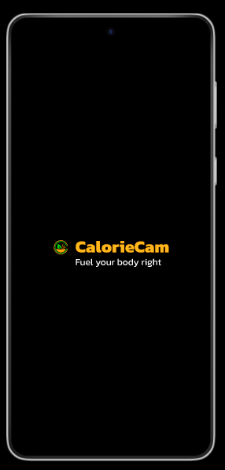
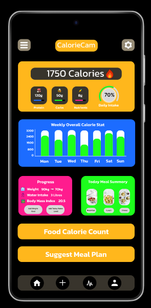
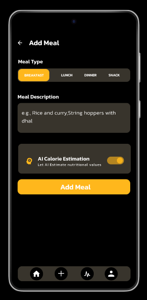
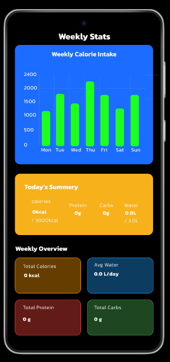
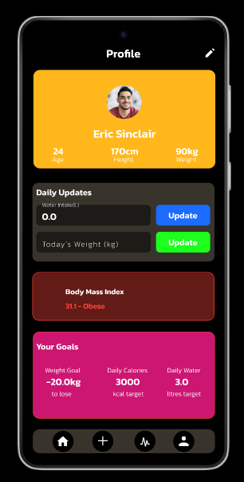
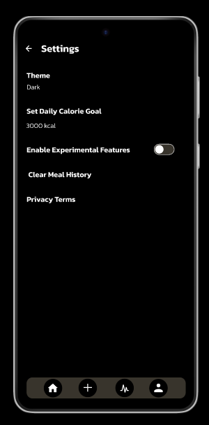

<p align="center">
  
</p>

<h1 align="center">CalorieCam – Smart Meal Tracker </h1>

**CalorieCam** is a Flutter-based mobile app designed to help users track daily calorie intake with a Sri Lankan food focus. It includes AI-powered features for calorie estimation, personalized meal logging, and weekly progress tracking — all wrapped in a clean, modern UI.

---

## 📸 App Screenshots


| Splash Screen | Home Screen | Add Meal | Weekly Stats | Profile | Settings |
|---------------|-------------|----------|--------------|---------|----------|
|  |  |  |  |  |  |


---

## 🚀 Features

- 🍱 **AI-powered calorie estimation** using OpenAI API  
- 🥗 **Meal input** for breakfast, lunch, and dinner  
- 📊 **Weekly calorie graphs** with visual insights  
- 👤 **Profile tracking** (weight, BMI, water intake)  
- 🌓 **Dark/Light mode** support  
- 📦 **Offline data storage** using SQLite  
- ⚙️ **Settings page** to customize app experience

---

## 🔧 Tech Stack

| Category           | Tech Used                  |
|--------------------|----------------------------|
| UI Development     | Flutter, Dart              |
| Design             | Figma                      |
| State Management   | `setState`, custom logic   |
| AI Integration     | OpenAI API (via OpenRouter)|
| Local Database     | SQLite + sqflite package   |
| Charts             | `fl_chart`                 |
| Navigation         | `go_router`                |

---

## ⚙️ Setup Instructions

1. **Clone this repo**:
   ```bash
   git clone https://github.com/Thilan7777/Meal-App.git
Install dependencies:

bash
Copy
Edit
flutter pub get
Add .env file:
Create a .env file in the root directory and add your OpenAI API key:

ini
Copy
Edit
OPENROUTER_API_KEY=your_api_key_here
Run the app:

bash
Copy
Edit
flutter run
📌 Notes
Tested on Android devices (recommended resolution: 720p and above)

Supports light and dark mode

This is a student project built with real-world tech stack and clean design principles

👨‍💻 Author-
Thilan Kavinda
Student – BSc in Management Information Systems
🔗 [Connect with me on LinkedIn](https://www.linkedin.com/in/Thilan Kavinda)

📜 License
This project is open-source and available under the MIT License.
